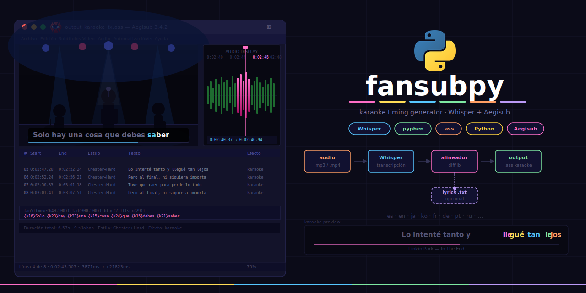

# Fansubpy 🎵
 > ⚠️ Este script fue desarrollado por [Claude](https://claude.ai) (Anthropic) en colaboración con Carlos Naveda. Es una primera versión funcional que se irá mejorando con el tiempo.


---
## ¿Qué hace fansubpy?
Script de Python para generar subtítulos karaoke con timing sílaba por sílaba a partir de un archivo de audio o video, genera un archivo .ass listo para importar en **Aegisub**.

1. Usa **Whisper** (OpenAI) para transcribir el audio y obtener timestamps por palabra
2. Usa el **lyric** como referencia para respetar los cortes de línea exactos
3. Alinea inteligentemente el lyric con los timestamps de Whisper usando `difflib`
4. Silabea cada palabra con **pyphen**
5. Exporta un archivo `.ass` con tags `\k` por sílaba, listo para Aegisub
6. Podemos aplicar **efectos** ya creados a todas las líneas del archivo `.ass`

## ¿Quieres ver los videos ya generados con fansubpy?
Pueden ver los videos en: https://minily.cc/fansubpy  
Descarga los videos para que puedan verlo en toda su calidad 😃

## Notas

1. Sobre el <span style="color:#3C8CE2">timing</span>: El timing sílaba por sílaba es una **aproximación** — distribuye el tiempo de cada palabra proporcionalmente entre sus sílabas. Si se requiere más precisión habrá ajustes manuales que hacer en Aegisub.
2. Sobre el <span style="color:#3C8CE2">idioma</span>: Por default se usa el mismo lenguaje del archivo de audio a utilizar. En caso se requiera modificar se puede hacer en el archivo "main.py" sección "Configuración".
3. Sobre los <span style="color:#3C8CE2">formatos</span>: El script acepta cualquier formato de audio/video que soporte FFmpeg.
4. Sobre <span style="color:#ff6b6b">problemas conocidos</span>: (Este tipo de problemas he visto que se requiere solucionar manualmente ya en Aegisub)
- Start adelantado — Whisper adelanta el inicio de frases al silencio previo (110 ms–1230 ms). Afecta principalmente frases tras pausas musicales o instrumentales.
- Silabeo proporcional — Las sílabas se distribuyen en tiempo igual dentro de cada palabra. No detecta que una sílaba se canta más larga que otra.
- Palabras perdidas por Whisper — Ocasionalmente Whisper no transcribe una palabra (ej. "cielo"). El alineador la interpola con timing estimado.
- Timestamps de fin — Ligeras imprecisiones en el end de líneas con palabras largas o notas sostenidas.

5. Sobre <span style="color:#62BC8C">estimado de precisión</span>:
Si separamos los tipos de ajuste:
- Estructura de líneas (qué palabras van en cada línea): ~95% correcto 
- Timing de línea (start/end): ~60% correcto sin ajuste (los 28 sin problema de start/end)
- Silabeo por distribución: funcional, pero siempre necesita ajuste fino en canciones lentas o con notas sostenidas
- Estimado global: 60–65% listo para usar directamente, 35–40% requiere ajuste manual en Aegisub.

---
## Estructura del proyecto
<!-- AUTO:estructura -->
```
README.md  # readme con todo el detalle para usar el proyecto
assets/ 
    ├── banner.png
    ├── logo.png
    └── logo_sinfondo.png
fansubs/   # proyectos terminados con fansubpy
fx/   # efectos visuales para aplicar al archivo .ass con timing
    ├── core
    │   ├── __init__.py
    │   ├── constants.py  # constantes globales de animación
    │   └── particles.py  # helpers de partículas compartidos
    ├── effects
    │   ├── __init__.py
    │   ├── barca_bounce.py  # Efecto Barça — Bolitas que rebotan de sílaba en sílaba con estrellitas de colores.
    │   ├── glitch_electric.py  # Aberración cromática eléctrica — 3 capas superpuestas (R/B offset + base).
    │   ├── rap_hit.py  # Golpes secos sin onda sinusoidal — feel de rap.
    │   └── wave.py  # Ola suave con sacudida vertical en sílaba activa.
    └── run.py  # punto de entrada — genera el _fx.ass
generate_readme.py  # regenera las secciones dinámicas del README
init.py  # crea la estructura del proyecto en /fansubs/<Proyecto>
main.py  # genera output_karaoke.ass con Whisper
```
<!-- /AUTO:estructura -->

---

## Requisitos previos

### 1. Python
Descarga e instala Python 3.12 desde [python.org](https://www.python.org/downloads/).

> ⚠️ Evita Python 3.14 por ahora — PyTorch aún no tiene soporte CUDA para esa versión.

### 2. FFmpeg
FFmpeg es necesario para que Whisper pueda leer archivos de audio/video.

**Instalación en Windows:**
1. Descarga el zip desde [ffmpeg.org/download.html](https://ffmpeg.org/download.html) → Windows → `ffmpeg-release-essentials.zip`
2. Extrae en `C:\ffmpeg`
3. Agrega `C:\ffmpeg\bin` al PATH del sistema:
   - Busca "Variables de entorno" en el inicio de Windows
   - Variables del sistema → `Path` → Editar → Nuevo → pega `C:\ffmpeg\bin`
4. Cierra y vuelve a abrir la terminal
5. Verifica con:
```bash
ffmpeg -version
```
### 3. Aegisub
Descarga e instala Aegisub última versión desde [aegisub.org](https://aegisub.org/).

---
## Instalación

### 1. Crea y activa un entorno virtual
```bash
python -m venv .venv
.\.venv\Scripts\activate
```

### 2. Instala las dependencias
```bash
pip install openai-whisper pyphen
```
---
## Flujo de trabajo
### 1. Crear el proyecto
El siguiente comando creará una carpeta llamada `Proyecto` y dentro generará la estructura oficial.
```bash
python init.py <Proyecto>
```

### 2. Configurar el proyecto
Aquí se explica qué debe contener cada carpeta dentro del proyecto
```
fansubs/
└── Proyecto/
    ├── audio/   → aquí coloca el arhivo que contiene el audio a fansubear (puede ser video o audio)    
    ├── lyrics/  → aquí coloca el .txt con la letra en caso la tuvieras (es opcional)
    ├── timing/ → se genera automáticamente    
    └── styles/  → aquí coloca los estilos desde Aegisub (esto se coloca ya al final cuando tengas finalizado tu fansub)
    
```
### 3. Timing al audio/video
El siguiente comando generará el timing al archivo que contiene el audio de la carpeta `audio/`, al finalizar generará en `timing/` el archivo `.ass`
```bash
python main.py <Proyecto>            # video horizontal (1920x1080)
python main.py <Proyecto> --vertical # video vertical (1080x1920)
```
Necesita: `fansubs/<Proyecto>/audio/*.mp4` (Puede ser otros formatos "*.mp3", "*.mp4", "*.wav", "*.m4a", "*.flac")  
Genera:   `fansubs/<Proyecto>/timing/output_karaoke.ass`


### 4. Revisar el timeo en  Aesgisub
Aquí se realizan los ajustes necesarios y aplican estilos manualmente.

### 5. Aplicar efectos FX
Para aplicar los efectos es necesario adaptar el código de `fx/run.py` para aplicar los efectos deseados, hay algunos efectos ya disponibles en `fx/`
```bash
python fx/run.py <Proyecto>
```
Lee:    `fansubs/<Proyecto>/timing/output_karaoke.ass`  
Genera: `fansubs/<Proyecto>/timing/output_karaoke_fx.ass` (ignorado en git por el peso que puede tener)

#### 5.1 Efectos disponibles
<!-- AUTO:efectos -->
| Archivo | Función | Descripción |
|---|---|---|
| `barca_bounce.py` | `barca_bounce` | Efecto Barça — Bolitas que rebotan de sílaba en sílaba con estrellitas de colores. |
| `glitch_electric.py` | `glitch_electric` | Aberración cromática eléctrica — 3 capas superpuestas (R/B offset + base). |
| `rap_hit.py` | `rap_hit` | Golpes secos sin onda sinusoidal — feel de rap. |
| `wave.py` | `wave` | Ola suave con sacudida vertical en sílaba activa. |
<!-- /AUTO:efectos -->

#### 5.2 Asignar efectos a estilos
Edita el `EFFECT_MAP` en `fx/run.py`:
```python
EFFECT_MAP = {
    ("NombreEstilo", "karaoke"): wave,
    ("OtroEstilo",   "karaoke"): rap_hit,
}
```
El primer valor es el nombre del estilo en Aegisub. El segundo es el campo `Efecto` de la línea.

### 6. Crear un nuevo efecto

Para describir un efecto de forma completa usa este protocolo:

| # | Campo | Qué incluir | Ejemplo |
|---|---|---|---|
| 01 | Paleta de colores | Hex con rol: apagado, activo, partículas | `#004D98` activo · `#9CA9D0` apagado |
| 02 | Imagen o símbolo | PNG en `assets/` o formas geométricas | `assets/catcule.png` sin fondo |
| 03 | Entrada de línea | Dirección, estado visual, ms antes del start | cae desde arriba · apagado · 400ms antes |
| 04 | Efecto por sílaba | Movimiento, color, partículas, elementos viajeros | bounce + flash blanco + estrellitas |
| 05 | Salida de línea | Dirección, color al salir | cae hacia abajo · fade · color activo |
| 06 | Estilo Aegisub | Nombre, fuente, tamaño, resolución, posición | Barza · Sara Condensed 50 · vertical · MarginV 320 |

**Opcionales:** referencia visual · feeling (épico / suave / agresivo) · qué NO quieres

### 7. Pegar subtítulos al video con FFmpeg
Una vez exportado el `.ass` final desde Aegisub:

```bash
ffmpeg -i "tu_video.mp4" -vf "ass=output_karaoke_fx.ass" "video_final.mp4"
```
> El font usado en el `.ass` debe estar instalado en tu sistema para que ffmpeg lo renderice correctamente.

---


### Créditos
[Claude](https://claude.ai) & Carlos Naveda 🤝